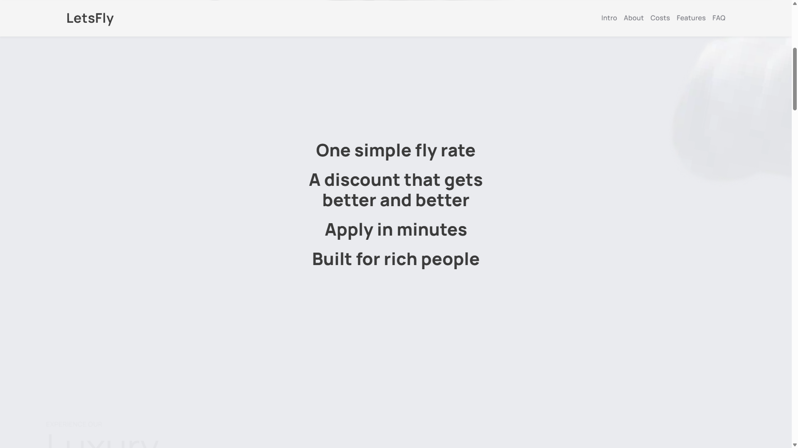
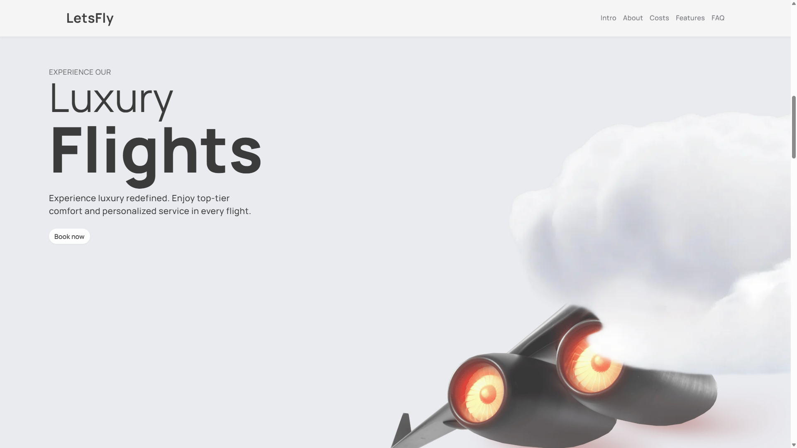
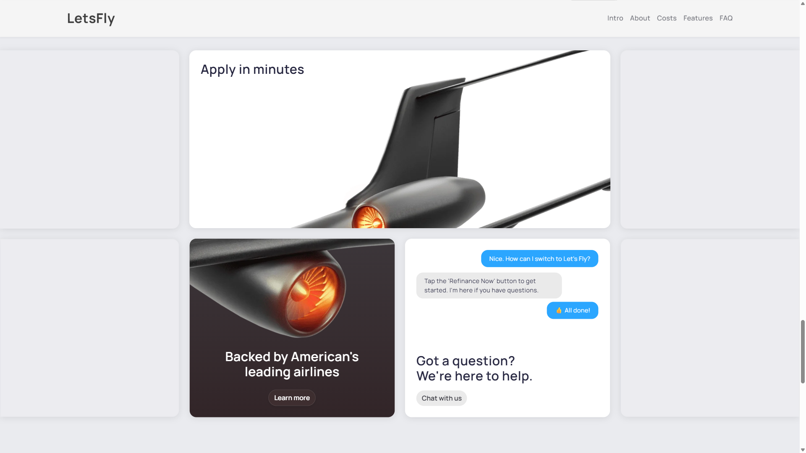
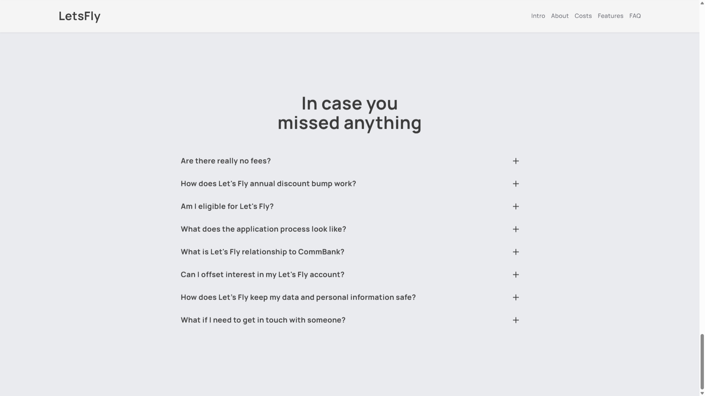

# Let's Fly Landing

Landing page for the **Let's Fly** educational project.

> A modern luxury-themed landing page built with **HTML**, **SCSS**, **Vite**, and **GSAP**.

---

## 🌐 Try it live

[](https://albert-alanreys.github.io/lets-fly-landing/)

> Click the button above to open the live demo of the Let's Fly landing page.

---

## 🧰 Tech Stack

> Overview of the main tools and libraries used in this project.

**Core:**

- **Vite** — fast build tool and development server
- **SCSS** — modular styling with variables and mixins
- **GSAP** — animation engine for smooth parallax effects

**Development Tools:**

- **GitHub Actions** — CI/CD for automatic deployment to GitHub Pages

---

## 📸 Screenshots

This gallery showcases each section of the landing page.

#### Welcome section (Hero)


#### Mission highlights



#### Luxury flights section



#### Loyalty program and instant booking


#### Costs and personal discounts


#### Application and support cards



#### FAQ section



---

## ⚙️ Development

This project uses **npm** and requires **Node.js v22+**.

To run locally:

```bash
npm install
npm run dev
```

To build for production:

```bash
npm run build
```

After building, the output is located in the `dist/` directory.

---

## 🚀 Deployment

The project is automatically deployed to **GitHub Pages** via **GitHub Actions**.  
Workflow file: `.github/workflows/deploy.yml`.

You can view the live site here:  
👉 [https://albert-alanreys.github.io/lets-fly-landing/](https://albert-alanreys.github.io/lets-fly-landing/)

---

**License:** MIT  
**Author:** [Albert Alan-Reys](https://github.com/albert-alanreys)
